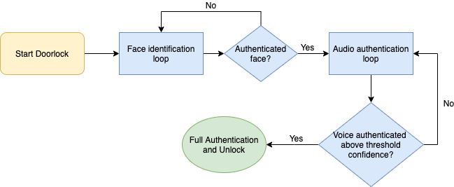
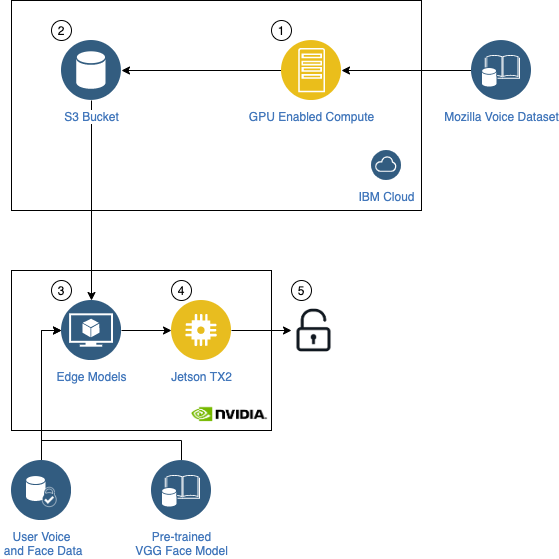

# Audio Visual Identity Verification aka Doorlock

This repository aims to use one-shot learning and a combination of speech and visual verification to authenticate a person for access. Using siamese networks, this project uses a very small example set for a new user in combination with trained siamese networks to classify if a person's voice and face match the small example set above a confidence threshold.

#### Application Flow

#### Overall Architecture

1. Model training: Train audiomodel using powerful GPU enabled compute using Mozilla Voice Dataset

2. Store model weights: Trained model information stored in S3

3. Retrieve model weights: Pull down audio model weights from S3 and pull in pre-trained VGG Face model for inference on edge device

4. Model inference: Using pre-trained models and local user data, perform authentication inference on NVIDIA Jetson TX2

5. Authenticate users: Based on model output, optionally authenticate users

#### How to Run

##### Doorlock User Authentication
Starts a loop waiting to authenticate a user's face and audio signals.

1. cd src
2. docker build -t doorlock .
3. docker run -it --privileged --device=/dev/video1:/dev/video1 doorlock 

##### Face Authentication
This directory can be used to run face authentication in isolation.

1. sudo docker run -it --privileged --device=/dev/video1:/dev/video1 face_auth
2. Within the container, run python3 face_identify_demo.py

##### Audio Authentication
This directory can be used to run audio authentication in isolation.

1. cd audio_authentication
2. docker build -t audio_auth .
3. docker run -it audio_auth
4. Within the container, run python3 audio_authentication_inference.py

#### One-Shot Learning?

"People can learn a new concept from just one or a few examples, making meaningful generalizations that go far beyond the observed data. Replicating this ability in machines has been challenging, since standard learning algorithms require tens, hundreds, or thousands of examples before reaching a high level of classification performance" [1]. (With Deep Learning, the dataset requirement has grown to 100K+).

1. Lake, Lee, et. al. One-shot learning of generative speech concepts. 2014. (https://groups.csail.mit.edu/sls/publications/2014/lake-cogsci14.pdf).

#### Sources:

- G Koch, R Zemel, and R Salakhutdinov. Siamese neural networks for one-shot image recognition. In
ICML Deep Learning workshop, 2015. (http://www.cs.toronto.edu/~zemel/documents/oneshot1.pdf).

Mozilla’s Common Voice Project: https://voice.mozilla.org/en/datasets

Siamese Neural Networks for One-shot Image Recognition: https://www.cs.cmu.edu/~rsalakhu/papers/oneshot1.pdf

SigNet: Convolutional Siamese Network for Writer Independent Offline Signature Verification: https://arxiv.org/abs/1707.02131

One-shot learning of generative speech concepts: https://groups.csail.mit.edu/sls/publications/2014/lake-cogsci14.pdf

Few Shot Speaker Recognition using Deep Neural Networks: https://arxiv.org/pdf/1904.08775.pdf

How to do Speech Recognition with Deep Learning (cool 101 guide): https://medium.com/@ageitgey/machine-learning-is-fun-part-6-how-to-do-speech-recognition-with-deep-learning-28293c162f7a

One Shot Learning with Siamese Networks using Keras: https://towardsdatascience.com/one-shot-learning-with-siamese-networks-using-keras-17f34e75bb3d

The Ultimate Guide To Speech Recognition With Python: https://realpython.com/python-speech-recognition/

You Only Speak Once: https://github.com/Speaker-Identification/You-Only-Speak-Once

One Shot Audio: https://github.com/zdmc23/oneshot-audio/blob/master/OneShot.ipynb

Keras Face Identification in Real Time: https://github.com/Tony607/Keras_face_identification_realtime

VGG Face: http://www.robots.ox.ac.uk/~vgg/data/vgg_face2/

VGG Face: https://github.com/ox-vgg/vgg_face2/
